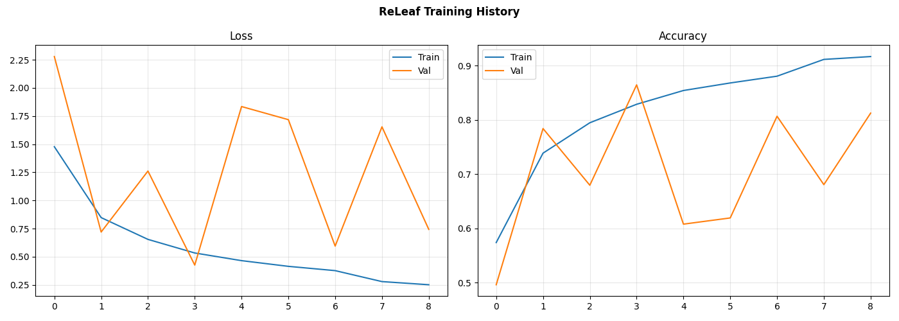
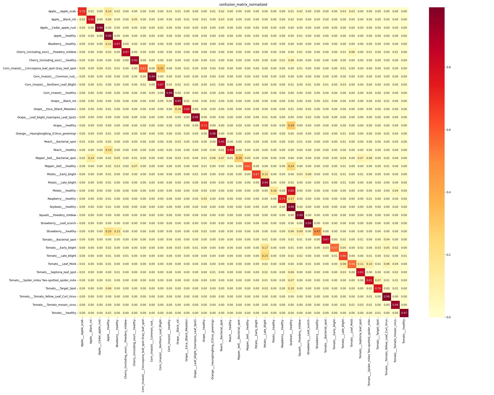
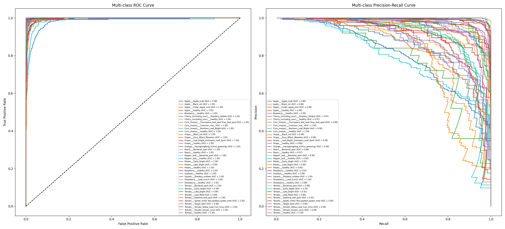

# ReLeaf: Plant Disease Detection System

> A deep learning-based classification system for identifying 38 distinct plant health categories across multiple species using Convolutional Neural Networks (CNNs).

---

## Project overview

The ReLeaf project addresses agricultural productivity by **providing rapid, automated diagnosis** of plant diseases. By analyzing **leaf imagery**, the model distinguishes between healthy plants and various bacterial, fungal, or viral infections.  

The model is trained on the PlantVillage dataset, encompassing **over 54000 records** across species like Apple, Corn, Grape, Tomato, and more.

---

## Tech stack

- **Frameworks** - Tensorflow/Keras, FastAPI
- **Tools** - Numpy, Matplotlib, Sickit-Learn, Seaborn, Google Colab
- **Deployment** - Uvicorn, Ngrok for live API tunneling

---

## Dataset Used
*   Kaggle link: https://www.kaggle.com/datasets/abdallahalidev/plantvillage-dataset

## Class Names
```bash
{
  "Apple___Apple_scab",
  "Apple___Black_rot",
  "Apple___Cedar_apple_rust",
  "Apple___healthy",
  "Blueberry___healthy",
  "Cherry_(including_sour)___Powdery_mildew",
  "Cherry_(including_sour)___healthy",
  "Corn_(maize)___Cercospora_leaf_spot Gray_leaf_spot",
  "Corn_(maize)___Common_rust_",
  "Corn_(maize)___Northern_Leaf_Blight",
  "Corn_(maize)___healthy",
  "Grape___Black_rot",
  "Grape___Esca_(Black_Measles)",
  "Grape___Leaf_blight_(Isariopsis_Leaf_Spot)",
  "Grape___healthy",
  "Orange___Haunglongbing_(Citrus_greening)",
  "Peach___Bacterial_spot",
  "Peach___healthy",
  "Pepper,_bell___Bacterial_spot",
  "Pepper,_bell___healthy",
  "Potato___Early_blight",
  "Potato___Late_blight",
  "Potato___healthy",
  "Raspberry___healthy",
  "Soybean___healthy",
  "Squash___Powdery_mildew",
  "Strawberry___Leaf_scorch",
  "Strawberry___healthy",
  "Tomato___Bacterial_spot",
  "Tomato___Early_blight",
  "Tomato___Late_blight",
  "Tomato___Leaf_Mold",
  "Tomato___Septoria_leaf_spot",
  "Tomato___Spider_mites Two-spotted_spider_mite",
  "Tomato___Target_Spot",
  "Tomato___Tomato_Yellow_Leaf_Curl_Virus",
  "Tomato___Tomato_mosaic_virus",
  "Tomato___healthy"
}
```

---

# Model Architecture Report: ReLeaf Baseline CNN

The **ReLeaf_Baseline_CNN** is a custom-engineered deep learning model designed for high-accuracy plant disease classification. It utilizes a sequential Convolutional Neural Network (CNN) architecture optimized for both diagnostic precision and computational efficiency.

---

## 1. Architectural Design
The model follows a hierarchical feature extraction pattern, processing input images through four distinct convolutional blocks.

### Input Specifications
*   **Input Shape**: $224 \times 224 \times 3$ (RGB).
*   **Dtype**: `float32`.

### Feature Extraction (Convolutional Blocks)
Each of the four blocks is designed to capture increasingly complex visual patterns, from simple edges to specific disease lesions.

| Block | Layer Type | Filters | Kernel Size | Parameters |
| :--- | :--- | :--- | :--- | :--- |
| **Block 1** | Conv2D + BatchNorm | 32 | $3 \times 3$ | 864 |
| **Block 2** | Conv2D + BatchNorm | 64 | $3 \times 3$ | 18,688 |
| **Block 3** | Conv2D + BatchNorm | 128 | $3 \times 3$ | 74,240 |
| **Block 4** | Conv2D + BatchNorm | 256 | $3 \times 3$ | 295,936 |

*   **Downsampling**: Each block concludes with a **MaxPooling2D** layer to reduce spatial dimensions.
*   **Regularization**: **Dropout** layers are integrated into every block to prevent overfitting by randomly deactivating neurons during training.
*   **Activation**: All hidden layers utilize the **ReLU** activation function.

### Classification Head
*   **GlobalAveragePooling2D**: Instead of flattening, this layer averages the spatial dimensions, significantly reducing the parameter count and improving generalization.
*   **Dense Layer**: A 256-unit fully connected layer for final feature integration.
*   **Output Layer**: A 38-unit **Softmax** layer corresponding to the 38 plant disease classes.

---

## 2. Performance Analysis
The model was evaluated over 8 training epochs, as documented in **training_history.png**.

*   **Training Trajectory**: Accuracy reached a peak of **~91%**, while loss dropped consistently from **1.50** to **0.25**.

*   **Validation Stability**: Validation accuracy showed fluctuations, peaking near **81%**, suggesting the model is sensitive to variance in the validation data.

*   **Metric Accuracy**: The overall system achieved an **86% accuracy** and an **88% weighted precision** across the 10,861 validation samples.

---

## 3. Reliability & Insights
Detailed diagnostics from **roc_pr_curve_3.png** and **model_classification_report.txt** provide a deeper look at model reliability.

*   **Perfect Detection**: The model achieved an F1-score of **1.00** for **Corn Common Rust**.

*   **Complex Classes**: Diseases like **Tomato Late Blight** and **Potato Early Blight** exhibit overlapping curves in the Precision-Recall analysis, indicating visual similarities that the model must navigate.

*   **Recall Gaps**: Specific categories like **Potato Healthy (0.16 recall)** show a conservative bias, where the model prefers high precision over capturing every instance.

---

## 4. Hardware & Efficiency
*   **Total Parameters**: 466,182.

*   **Model Size**: ~1.9 MB.

*   **Deployment Readiness**: The low parameter count and use of Global Average Pooling make this architecture highly suitable for the **TFLite** conversion found in `To_Tflite.ipynb`.

## 5. Plots






## Key Insights
- **Exceptional Specificity in "Common Rust":** The model achieved a perfect F1-score of 1.00 for Corn_(maize)___Common_rust_. This indicates that the visual patterns of rust—typically raised, orange-brown pustules—are sufficiently unique that the model never confuses them with other corn diseases or healthy tissue.  

- **The "Safety First" Healthy Bias:** Classes like Apple___healthy and Soybean___healthy demonstrate very high recall (0.98) but significantly lower precision (0.61–0.80). This suggests a systematic bias where the model tends to classify ambiguous or slightly damaged leaves as "healthy" to minimize false disease alarms, leading to an influx of false positives in the healthy categories.  

- **Critical Recall Failure in Potato Healthy:** The Potato___healthy class has a recall of only 0.16, the lowest in the dataset. The confusion_matrix_normalized.png shows that healthy potato leaves are frequently misidentified as Potato___Early_blight or Late_blight. In a real-world scenario, this would result in a 84% "false alarm" rate for healthy potato crops.  

- **"Over-Cautious" Detection in Pepper Bell:** Pepper,_bell___Bacterial_spot displays a 1.00 precision but only 0.29 recall. While the model is perfectly accurate when it does flag this disease, it fails to detect over 70% of actual infections. It is effectively only identifying the most severe, textbook cases of the disease.  

- **Scalability with High-Support Classes:** The model performs best on classes with the largest sample sizes, such as Orange___Haunglongbing (1,106 samples) and Tomato___Tomato_Yellow_Leaf_Curl_Virus (1,044 samples), maintaining F1-scores of 0.95 or higher. This proves the architecture scales effectively when provided with high-volume training data.  

- **Cross-Disease Confusion in Potatoes:** There is a significant classification struggle between Potato___Early_blight and Potato___Late_blight. While Late Blight has high recall (0.94), its precision is poor at 0.51. The confusion matrix reveals that Early Blight is frequently mislabeled as Late Blight, likely due to the visual similarity of dark necrotic lesions.  

- **Strategic Success in Viral Detection:** For Tomato___Tomato_Yellow_Leaf_Curl_Virus, the model achieved a 0.98 recall. Since this virus can devastate entire yields if not caught early, the model's ability to almost never miss an infected plant makes it a highly valuable tool for early agricultural intervention.  

- **Intra-Species Feature Overlap (Apple):** Apple___Apple_scab is hampered by a relatively low recall of 0.70. According to.png, it is frequently confused with Apple___Black_rot. This indicates the CNN filters struggle to differentiate between the subtle textural differences of dark, scabby spots versus rot-induced lesions on the same host species.  

- **High Inter-Class Variance in Grapes:** Grape___Leaf_blight achieved a standout 0.96 F1-score. This suggests that Isariopsis Leaf Spot possesses highly distinct visual markers—such as its specific angular shape and reddish-brown hue—that do not overlap with the features of other grape diseases in the dataset.  

- **Macro vs. Weighted Performance Gap:** The Macro Average F1 (0.81) is noticeably lower than the Weighted Average F1 (0.86). This gap confirms that while the model is highly proficient at identifying common, well-represented diseases, it struggles with rarer classes. Improving the "Macro" performance will require targeted data augmentation for under-represented categories like Strawberry___healthy.

- **The "Recall-Gap" in Preventive Diagnostics:** One of the most significant insights from the model's performance is the high disparity between Precision and Recall in critical early-stage diseases.  

- *The Problem:* For classes like Pepper,_bell___Bacterial_spot (Recall: 0.29) and Potato___Early_blight (Recall: 0.67), the model is exceptionally "cautious". It has high Precision (0.99–1.00), meaning when it flags a disease, it is almost certainly right, but it misses a huge portion of actual infections.  

- *The Risk:* In an agricultural setting, Recall is often more important than Precision. Missing 71% of Bacterial Spot cases in a pepper field (as indicated by the 0.29 recall) could lead to an uncontrolled outbreak because the "silent" infections weren't flagged.  

- *The Root Cause:* Looking at training_history.png, the validation loss is highly volatile compared to the smooth training loss. This suggests the model is struggling to generalize the subtle, early-stage visual markers of these diseases across different lighting or leaf positions found in the validation set.  

- **Performance vs. Sample Volume (Support):** There is a direct correlation between the number of images available (Support) and the model's stability:

- *High Volume Success:* Orange___Haunglongbing and Tomato___Tomato_Yellow_Leaf_Curl_Virus have the highest support (>1,000 samples) and maintain F1-scores above 0.95.  

- *Low Volume Struggle:* Classes with low support, like Potato___healthy (25 samples), show disastrous recall (0.16). The model hasn't seen enough "normal" potato leaves to distinguish them from diseased ones, leading it to over-classify them as "Early Blight" in the confusion matrix.

## Model Summary

Model: "ReLeaf_Baseline_CNN"

| Layer (type) | Output Shape | Param # | 
| :--- | :--- | :--- |   
| input_layer_1 (InputLayer) | (None, 224, 224, 3) | 0 |
| conv2d (Conv2D) | (None, 222, 222, 32) | 864 |
| batch_normalization | (None, 222, 222, 32) | 128 |
| (BatchNormalization) | | |
| activation (Activation) | (None, 222, 222, 32) | 0 |
| max_pooling2d (MaxPooling2D) | (None, 111, 111, 32) | 0 |
| dropout (Dropout) | (None, 111, 111, 32)   | 0 |
| conv2d_1 (Conv2D) | (None, 109, 109, 64)   | 18,432 |
| batch_normalization_1 | (None, 109, 109, 64)   | 256 |
| (BatchNormalization) | | |
| activation_1 (Activation) | (None, 109, 109, 64) | 0 |
| max_pooling2d_1 (MaxPooling2D) | (None, 54, 54, 64) | 0 |
| dropout_1 (Dropout) | (None, 54, 54, 64) | 0 |
| conv2d_2 (Conv2D) | (None, 52, 52, 128) | 73,728 |
| batch_normalization_2 | (None, 52, 52, 128) | 512 |
| (BatchNormalization) | | |
| activation_2 (Activation) | (None, 52, 52, 128) | 0 |
| max_pooling2d_2 (MaxPooling2D) | (None, 26, 26, 128) | 0 |
| dropout_2 (Dropout) | (None, 26, 26, 128) | 0 |
| conv2d_3 (Conv2D) | (None, 24, 24, 256) | 294,912 |
| batch_normalization_3 | (None, 24, 24, 256) | 1,024 |
| (BatchNormalization) | | |
| activation_3 (Activation) | (None, 24, 24, 256) | 0 |
| max_pooling2d_3 (MaxPooling2D) | (None, 12, 12, 256) | 0 |
| dropout_3 (Dropout) | (None, 12, 12, 256) | 0 |
| global_average_pooling2d | (None, 256) | 0 |
| (GlobalAveragePooling2D) | | |
| dense (Dense) | (None, 256) | 65,536 |
| batch_normalization_4 | (None, 256) | 1,024 |
| (BatchNormalization) | | |
| activation_4 (Activation) | (None, 256) | 0 |
| dropout_4 (Dropout) | (None, 256) | 0 |
| dense_1 (Dense) | (None, 38) | 9,766 |

 Total params: 466,182 (1.78 MB)
 Trainable params: 464,710 (1.77 MB)
 Non-trainable params: 1,472 (5.75 KB)

## Model Classification Report


|                                                  |  precision |   recall | f1-score |  support |
| :--- | :--- | :--- | :--- | :--- |
|                               Apple___Apple_scab |      0.81   |  0.70   |   0.75   |    126  |
|                                 Apple___Black_rot|      0.77   |  0.80   |   0.79   |    132  |
|                         Apple___Cedar_apple_rust |     0.84    |  0.98  |    0.91   |     55  |
|                                  Apple___healthy |     0.61    | 0.98   |   0.76    |   329   |
|                              Blueberry___healthy |     0.85    | 0.87   |   0.86    |   295   |
|         Cherry_(including_sour)___Powdery_mildew |     0.97    | 0.87   |   0.92    |   232 |
|                Cherry_(including_sour)___healthy |     0.82    | 0.93  |    0.87    |   167 |
| Corn_(maize)___Cercospora_leaf_spot Gray_leaf_spot|       0.94  |    0.61  |    0.74   |    108 |
|                      Corn_(maize)___Common_rust_  |    1.00    |  0.99   |   1.00   |    219  |
|              Corn_(maize)___Northern_Leaf_Blight  |    0.83   |   0.87  |    0.85   |    195  |
|                           Corn_(maize)___healthy  |    0.98   |   0.99  |    0.98   |    227  |
|                                Grape___Black_rot  |    0.78   |  0.95   |   0.85   |    274   |
|                     Grape___Esca_(Black_Measles)  |    0.96  |    0.80  |    0.87  |     268  |
|       Grape___Leaf_blight_(Isariopsis_Leaf_Spot)  |    0.98  |   0.95   |   0.96   |    222  |
|                                  Grape___healthy  |    0.81  |   0.71    |  0.75    |    85  |
|         Orange___Haunglongbing_(Citrus_greening)  |    0.97  |    0.96   |   0.96  |    1106  |
|                           Peach___Bacterial_spot  |    0.94  |    0.90   |   0.92   |    466  |
|                                  Peach___healthy  |    0.97  |    0.80   |   0.88   |     81  |
|                    Pepper,_bell___Bacterial_spot  |    1.00  |    0.29  |    0.45   |    217  |
|                           Pepper,_bell___healthy  |    0.94  |    0.61   |   0.74   |    294  |
|                            Potato___Early_blight  |    0.99  |    0.67   |   0.80   |    203  |
|                             Potato___Late_blight  |    0.51  |    0.94   |   0.66   |    202  |
|                                 Potato___healthy  |    1.00  |    0.16   |   0.28  |      25  |
|                              Raspberry___healthy  |    0.93  |    0.75   |    0.83  |      76  |
|                                Soybean___healthy  |    0.80  |    0.98   |   0.88   |    999  |
|                          Squash___Powdery_mildew  |    0.89  |    0.99   |   0.93   |    359  |
|                         Strawberry___Leaf_scorch  |    0.89  |    0.99   |   0.94  |     229  |
|                             Strawberry___healthy  |    0.96  |    0.47   |   0.63   |     95  |
|                          Tomato___Bacterial_spot  |    0.95  |    0.87   |   0.91   |     438 |
|                            Tomato___Early_blight  |    0.92  |    0.57   |   0.70   |    186  |
|                             Tomato___Late_blight  |    0.73  |    0.66   |   0.69   |    376  |
|                               Tomato___Leaf_Mold  |    0.82  |    0.56   |   0.67  |     189  |
|                      Tomato___Septoria_leaf_spot  |    0.85  |    0.83   |   0.84  |     335  |
|   Tomato___Spider_mites Two-spotted_spider_mite   |   0.83   |   0.81    |  0.82   |    334   |
|                             Tomato___Target_Spot  |    0.86  |    0.76   |   0.81   |    279   |
|           Tomato___Tomato_Yellow_Leaf_Curl_Virus  |    0.93   |   0.98   |   0.95   |   1044   |
|                     Tomato___Tomato_mosaic_virus  |    0.72   |   0.94   |   0.81   |     77  |
|                                 Tomato___healthy  |    0.98   |   0.97   |   0.98   |    317  |
| --- | --- | --- | --- | --- |
|                                        accuracy  |           |          |    0.86  |   10861 |
|                                        macro avg  |    0.88   |   0.80   |   0.81  |   10861 |
|                                     weighted avg  |    0.88   |   0.86   |   0.86   |  10861 |


---

# How to run

```bash
# 1. Install dependencies
pip install ai-edge-litert fastapi uvicorn pyngrok nest_asyncio 
```

## Execution Workflow
Instead of sequential scripts, this project is organized into functional notebooks. Follow this order to reproduce the results shown in training_history.png and roc_pr_curve.png:  

1. **Model Development (Plant_disease_detection.ipynb)**
- *Purpose:* Data loading, preprocessing, and core model training.  
- *Process:* Implements the ReLeaf_Baseline_CNN architecture.  
- *Output:* Generates the initial training weights and logs the performance metrics found in model_classification_report.txt.  

2. **Evaluation & Diagnostics (Plots.ipynb)**
- *Purpose:* Visualizing model performance and identifying class-level weaknesses.  
- *Key Outputs:*
    - *confusion_matrix_normalized.png:* Used to identify misclassification clusters between similar species.  
    - *roc_pr_curve.png:* Analyzes the precision-recall trade-off across all 38 categories.  

3. **Optimization (To_Tflite.ipynb)**
- *Purpose:* Converting the heavy Keras model into an efficient format for edge deployment.  - *Details:* Compresses the 466,182 parameters into a .tflite file to reduce latency for the live API.  

4. **Deployment (Main_backend.ipynb)**
- *Purpose:* Launches the FastAPI/Uvicorn server to host the model.  
- *Functionality:* Contains the /predict endpoint logic that processes leaf images and returns the Top-5 diagnosis results. 
- **Access Documentation**: Navigate to `/docs` on your live URL to test the `POST /predict` endpoint. 
- **Submit Image**: Upload a `.jpg` or `.png` leaf image to receive a JSON response of the Top 5 predictions.

---

## Author

Built as a portfolio project for Data Science / ML roles.
